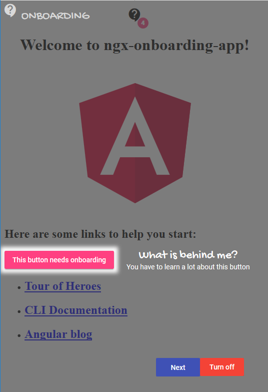

# ngx-onboarding

An onboarding library for Angular x applications.



## Overview

The Onboarding library gives you the possibility to add a tutorial directly into your angular application. 
After that users learn easily how to use your application and the learning curve is not so high.

You can specify an onboarding element on every html element you want.

## Features

- Definition of several steps on each view.
- Highlighting of every step.
- Configurable on which position (top, bottom, left or right) the information text should be displayed.
- Multiple language support
- If onboarding is enabled, buttons are visible to switch to the next step or turn off onboarding
- If a user has seen the onboarding of a view, it will be stored per default to the local storage of the browser.
- Possibility to reset and turn on again the onboarding.

## Installation

The library is published as a [scoped NPM package](https://docs.npmjs.com/misc/scope) in the [NPMJS Rosen-Group account](https://www.npmjs.com/~rosen-group)

```
npm install --save @rosen-group/ngx-onboarding
```

### Peer Dependencies

- [angular-material](https://www.npmjs.com/package/angular-material)
- [@angular/cdk](https://www.npmjs.com/package/@angular/cdk)
- [ngx-uid](https://www.npmjs.com/package/ngx-uid)

For detailed information how to use Angular material please have a look at the [Angular material getting started page](https://material.angular.io/guide/getting-started) and follow the installations instructions.

## Usage

Add the rosen-onboarding-component anywhere to your main component, e.g. app.component

```
<rosen-onboarding></rosen-onboarding>
```


The onboarding contains a button component which provides a context menu for resetting and turning on again the onboarding feature. 
Place this button into your application where you want.

```
<rosen-onboarding-button title="ONBOARDING"></rosen-onboarding-button>
```

The messages will be configured in json files.

Place the json file(s) where you are able to load them on application runtime. 

### Example
```
[
    {
        "selector": "#logo-img",
        "group": "example0",
        "position": "top",
        "headline": "Angular Logo",
        "details": "This is the angular logo",
        "descriptions": [
            {
                "language": "de",
                "headline": "html tag headline de",
                "details": "htmp tag details de"
            }
        ]
    },
    {
        "selector": "#button-that-needs-onboarding",
        "group": "example1",
        "position": "right",
        "textAlign": "left",
        "headline": "What is behind me?",
        "details": "You have to learn a lot about this button",
        "descriptions": [
            {
                "language": "de",
                "headline": "html tag headline de",
                "details": "htmp tag details de"
            }
        ]
    }
]
```

### Property descriptions

|  Property | Type | Default value   | Description  |
|---|---|---|---|
|  selector |  string | null  | The css selector which identifies the html element you want to describe. |
|  group | string  |  null | Groups in the same view will be displayed together |
|  position | top / bottom / right / left  |  bottom | Positioning of the headline and details |
|  textAlign | left / right / center | center  | Alignment of the headline and details |
| headline  |  string | null  | Headline text for a single onboarding item |
| details  | string  |  null | Details text for a single onboarding item|
| descriptions  | Array  | null  | Collection of additional translations for headline and detail text |
|  -- language | string  | null  | Language key, e.g. en or de related to your translation definition |
|  -- headline | string  | null  | Translated headline text for a single onboarding item |
|  -- details | string  | null  | Translated details text for a single onboarding item|

Inject the OnboardingService into your component and load the configuration json file.

```
export class AppComponent implements OnInit, OnDestroy {
     private unregisterOnboarding: Function;
    
     constructor(private onboardingService: OnboardingService,
                 private httpClient: HttpClient) { 
     }
     
     public ngOnInit() {
         this.httpClient.get('assets/onboarding/example.json').subscribe((onboardingItems: Array<OnboardingItem>) => {
             this.unregisterOnboarding = this.onboardingService.register(onboardingItems);
         }, (error) => {
             // do your error handling
         });
     }
     
     public ngOnDestroy() {
         if (this.unregisterOnboarding) {
             this.unregisterOnboarding();
         }
     }
 }
```

## Translations (I18N)

See [I18N instructions](I18N.md)

## Browser Support

- Chrome
- Firefox
- Edge
- Internet Explorer 11 (with polyfills)

## For Contributors
See [CONTRIBUTING.md](https://github.com/rosen-group/ngx-onboarding) (todo: Link to file)
